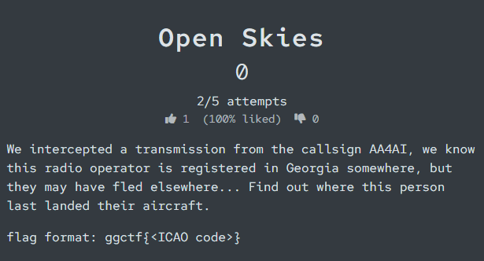
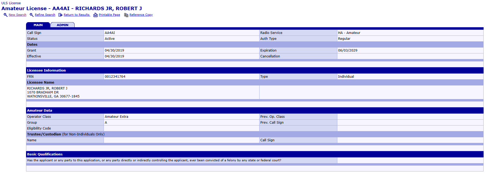
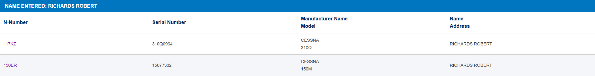
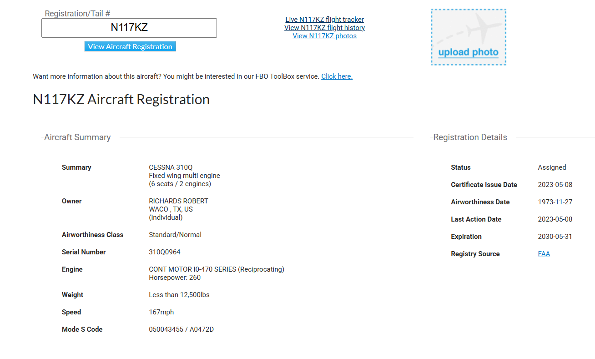

# GGCTF 2026 - Open Skies Writeup

## Challenge

## Solution

In this challenge, we are tasked with finding the ICAO code of the last landing of the aircraft associated with the callsign **AA4AI**.

### Step 1 - Investigating the Callsign

The challenge provides the radio call sign **AA4AI**. Since the radio callsigns in the United States are registered with the Federal Communications Commission (FCC), the first step is to search the FCC license database.

I navigated to the FCC License Search Page and searched for the callsign **AA4AI**.

[FCC License Search](https://wireless2.fcc.gov/UlsApp/UlsSearch/searchLicense.jsp)

After entering the callsign and clicking search, the website takes a few moments to return the license record.

The search results reveal that the callsign belongs to **Robert J Richards Jr**, located in Georgia.

This confirms the hint in the challenge description that the operator is registered somewhere near **Georgia**.

### Step 2 - Searching the FAA Aircraft Registry

Now that we have the operator's name (**Robert J Richards Jr**), the next step is to find out what aircraft he is associated with.

Aircraft registrations in the United States are maintained by the Federal Aviation Administration (FAA).  
Each registered aircraft is assigned a unique identifier known as an **N-number**, which is the aircraft's registration number used to identify it.

[FAA Aircraft Registry](https://registry.faa.gov/aircraftinquiry)

On the registry website, I selected the **Name** search option and searched for:

RICHARDS ROBERT

I initially tried searching for **RICHARDS JR**, but this did not return any results. Searching for **RICHARDS ROBERT** provided a list of aircraft registrations associated with individuals matching that name.

The search returned two aircraft associated with the name **RICHARDS ROBERT**:

- 117KZ – Cessna 310Q  
- 150ER – Cessna 150M  

These values represent the unique portion of the aircraft registration number.  
In the United States, aircraft registrations begin with the letter **N**, meaning the full aircraft registrations are:

- **N117KZ**
- **N150ER**

### Step 3 - Investigating the Aircraft

To determine which aircraft was relevant to the challenge, I searched both aircraft registrations individually on Google. I then opened the **FlightAware** result for each aircraft and observed that **N117KZ** listed the owner as **Richards Robert**.

After confirming the owner, I clicked on **Live N117KZ Flight Tracker** to view the aircraft’s recent flight activity. The tracker showed that the aircraft had most recently landed in **Waco, TX**.

### Step 4 - Determining the ICAO Code

Airports are commonly identified by an **IATA code**, which is a three-letter identifier used for commercial aviation.

In this case, the IATA code **ACT** corresponds to **Waco Regional Airport**.

However, the challenge asks for the **ICAO code**, which is a four-letter airport identifier with the first letter representing the region/country. In the United States, ICAO codes are formed by adding the letter **K** before the airport's IATA code.

Therefore, the ICAO code for Waco Regional Airport is:

**KACT**

**Flag: ggctf{KACT}**

